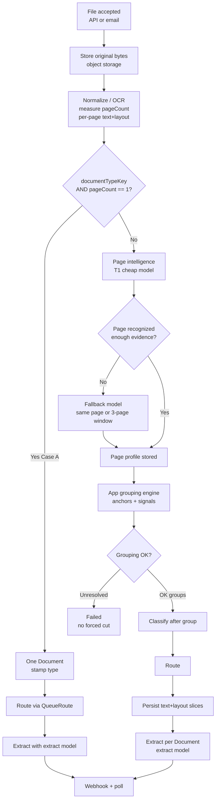
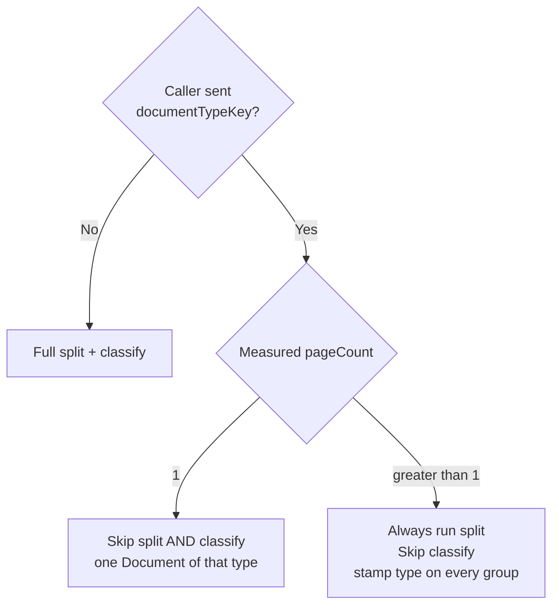
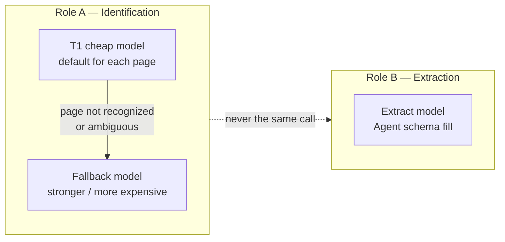
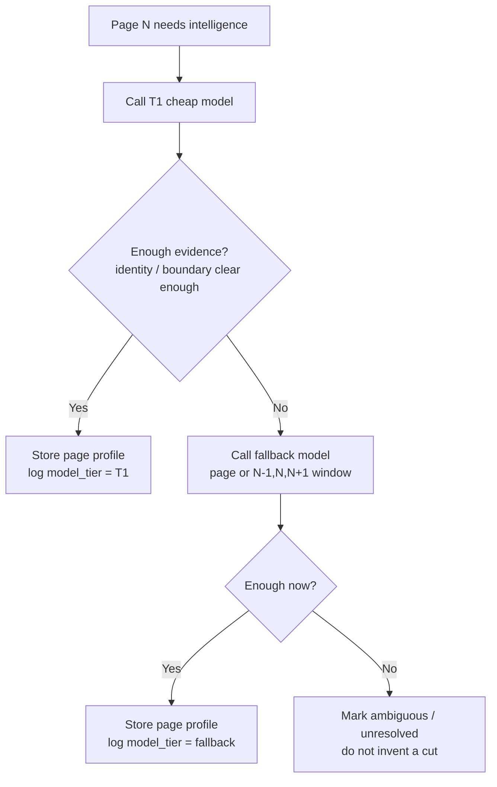
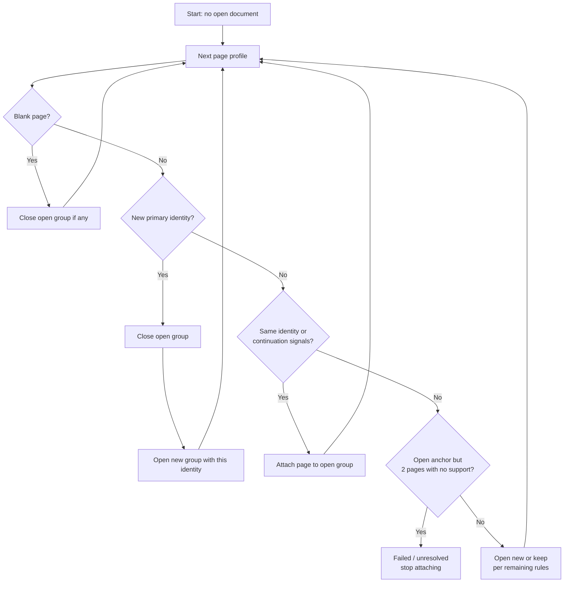
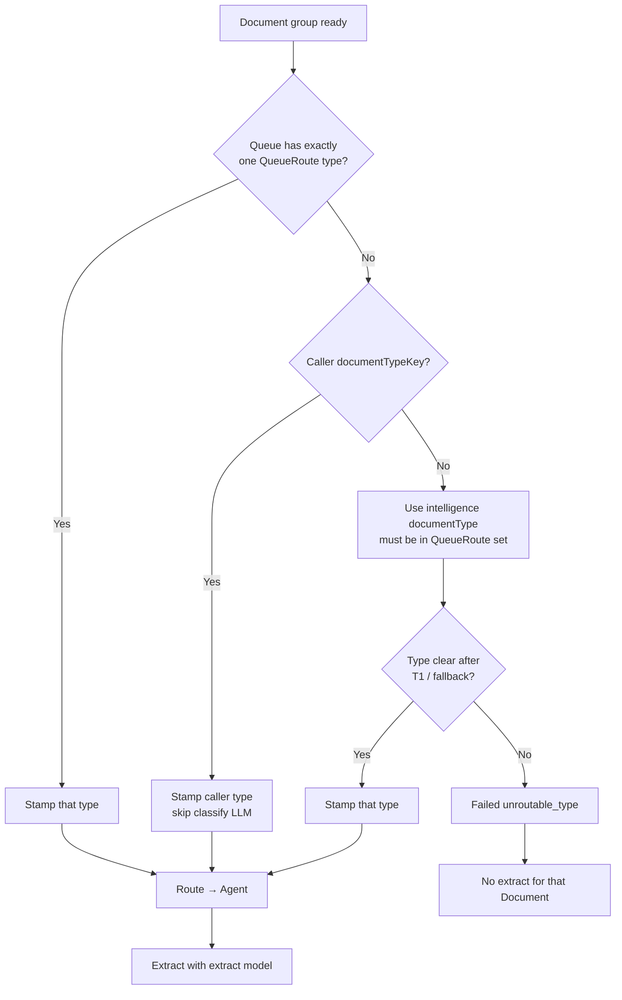
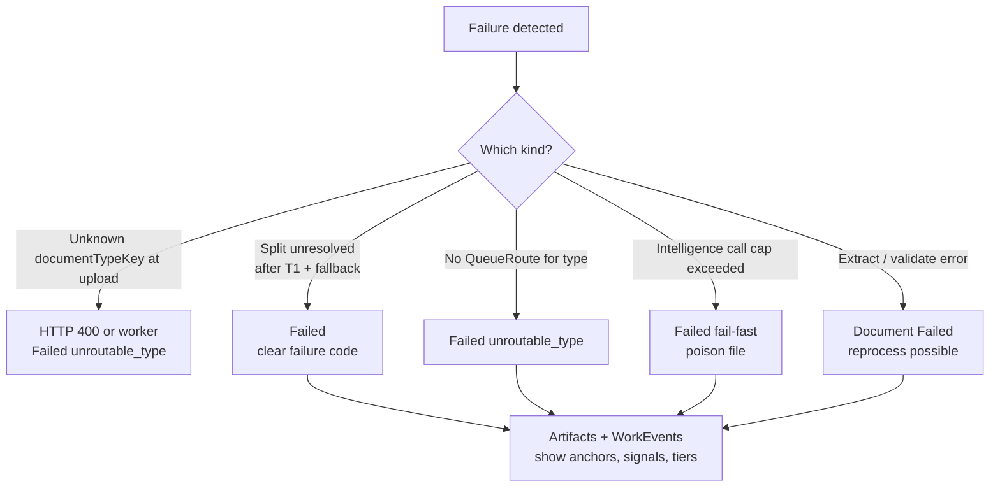

# Split & Classify — Plain-Language Guide

> **Audience:** Developers and product owners who want the locked design without reading the full exploration.  
> **Status:** Explains decisions locked **2026-09-15** (Plan 04 / Plan 03 Decision E).  
> **Canonical detail:** [04-split-classify-strategy-exploration.md](./04-split-classify-strategy-exploration.md) · Plan 03 Decision E  
> **Not yet in production code:** DQ-0702 only shipped the skeleton. Real P9 behavior is Wave 4b (follow-on DQ).

---

## 1. What problem this solves

A partner uploads **one PDF** (or email attachment). That file may contain:

- one invoice, or  
- several invoices, or  
- a mix (invoice + delivery note + credit note), or  
- one invoice that spans many pages.

Documate must:

1. **Split** — decide which pages belong to which logical business document.  
2. **Classify** — assign each logical document a **DocumentType** (invoice, DN, …).  
3. **Route** — pick the Agent for that type via **QueueRoute**.  
4. **Extract** — fill the Agent schema (separate step / separate model).

**Important vocabulary**

| Term | Meaning |
|------|---------|
| **File** | The stored upload (one PDF/blob). Owns the pipeline and rollup status. |
| **Document** | One logical business doc after split (e.g. INV-1001). Webhook unit. |
| **Split** | Page grouping — *where does each document start and end?* |
| **Classify** | Type assignment — *is this an invoice or a DN?* |
| **Intelligence (identification)** | Early LLM pass that reads a page for evidence (numbers, start/continue/complete). **Not** full extraction. |
| **Extract** | Later LLM pass that fills the Agent’s business schema. **Always separate** from intelligence. |

**Type is not the split key.** Two consecutive invoices share type `invoice` but are **two Documents** (INV-1001 vs INV-1002). We group by **document identity** (invoice number, etc.), not by type.

---

## 2. End-to-end pipeline (big picture)

Stages always exist in order: **normalize → split → classify → route → extract**.  
Case A only **skips** the work inside split+classify; route and extract still run.

---

## 3. When do we skip work? (intake hints)

The caller may send `documentTypeKey`. They do **not** send page count — **OCR measures** it.

| Situation | Split? | Classify? |
|-----------|--------|-----------|
| Type + **1 page** (Case A) | No | No |
| Type + **multi-page** | **Yes** | No (stamp caller type on each group) |
| No type | **Yes** | **Yes** (after grouping) |
| Queue has **exactly one** QueueRoute type (C1) | Yes (unless Case A) | No — stamp that single type after grouping |

`documentCount` from the caller, if ever present, is **audit only** — it never skips split.

---

## 4. Which models are used, and when?

There are **always two model roles**. Admins configure them in backoffice / system settings (partners never pick models).

| Step | Model | When it runs | What it returns |
|------|--------|--------------|-----------------|
| **Intelligence T1** | Cheap (admin-configured) | Every page that needs split (not Case A) | Page evidence: primary number, type guess, start / continue / complete, evidence list |
| **Intelligence fallback** | Expensive (admin-configured) | T1 insufficient / unrecognized / conflicting signals | Same evidence shape, higher quality; may use a **local 3-page window** (prev, current, next) |
| **Extract** | Separate extract model (admin-configured) | After grouping + route, **per Document** | Full Agent `documentData` / schema |

### What “fallback” means in practice

**Hard rules**

- Identification and extract are **never** one combined LLM call.  
- Fallback is for **intelligence only** — it does not run extract.  
- Escalation must **not** invent DocumentTypes outside the Queue’s QueueRoute list.  
- Per-File **call caps** stop poison files from burning unlimited $ (fail fast when exceeded).

---

## 5. How splitting works (app owns the cut)

The LLM does **not** say “split the PDF at page 3.”  
It produces **evidence per page**. The **application** groups pages.

### 5.1 What the app looks at (simple)

| Strong signals (prefer) | Weak / supporting only |
|-------------------------|-------------------------|
| Primary document number (INV-1001) | Document **type** alone |
| Continuation language / line items continue | Logos / visual similarity |
| Blank page as separator | Filename heuristics |
| “Page x of y” when printed | — |

### 5.2 Active anchor

While reading pages in order, the app keeps an **active document** (anchor) keyed by primary identity.

**Close the current document when:**

1. **Blank page** — close before the blank; skip the blank.  
2. **New primary identity** — different invoice/DN number → start a new group.  
3. **Printed sequence restart** — e.g. a new “page 1 of …” after a finished sequence.  
4. **N = 2** consecutive pages with **no continuation evidence** while an anchor is open → stop attaching; treat as **unresolved / Failed** (do not keep swallowing pages into the wrong doc).

### 5.3 After groups exist

For each group the app:

- Sets page range (`PageStart` / `PageEnd`).  
- Writes **text + layout slices** to object storage (S3 hybrid).  
- Keeps the **original File** (customer source PDF) — File-level download URL.  
- Caches signed URL + expiry on File (original) and on Document (**Document PDF only**).  
- **Document URL rule:** return/omit — **null until that Document’s PDF is generated**. Never use the parent File URL as the Document URL.  
- Materialize **per-Document PDF** after grouping so Document URLs can be issued.

---

## 6. How classification works (after split)

Classify runs **after** grouping — never “type each page then merge same types” (that would glue INV-1001 and INV-1002 together).

---

## 7. Failure handling (what “Failed” means)

**Principle:** A wrong silent cut is worse than a clear failure. We **do not force** a split when evidence is bad.

| Failure | Typical cause | What we do |
|---------|---------------|------------|
| `unroutable_type` | Type missing from QueueRoute, or no-hint type still unclear | Document **Failed**; no wrong Agent |
| Split unresolved | Conflicting identity / no continuation after fallback / N=2 rule | **Failed** — do **not** invent page cuts |
| Call cap | Too many intelligence/fallback calls on one File | **Failed** fast; protect cost |
| Wrong caller type | Partner asserted wrong `documentTypeKey` | Still routes to that type’s Agent — hints are **assertions** |
| Extract failure | Schema / LLM extract issues | Document Failed; split may still be valid; **reprocess** can retry |

**File rollup:** If some Documents succeed and others fail, File can be **PartialReady** (existing product status). Unresolved **groups** themselves are Failed — we don’t mark a bad cut as Ready.

**Webhooks & APIs (PDF URLs — locked 2026-09-15, Document rule amended):**

| Surface | Returns |
|---------|---------|
| Webhook `document.terminal` | Extracted `data` + Document PDF URL **only if materialized** (else omit) |
| External Document detail | Full Document; `download_url` **only if** Document PDF exists |
| External File detail | File `download_url` (original upload) + **full Document objects** (each Document URL per rule above) |

Cache URL+expiry on rows; refresh when expired. **Never** map Document URL → parent File. Slice text/layout stays internal.

**Reprocess:** Creates a new File from the same bytes and runs the pipeline again (existing product behavior).

---

## 8. Worked example

**Input:** 5-page PDF, no `documentTypeKey`. Queue routes: `invoice`, `delivery_note`.

| Page | Intelligence (T1 → maybe fallback) | App decision |
|------|-------------------------------------|--------------|
| 1 | INV-1001, starts, incomplete | Open group A |
| 2 | INV-1001, continues, complete | Attach to A; close A |
| 3 | INV-1002, starts+complete | Open+close group B |
| 4 | DN-88, starts, incomplete | Open group C |
| 5 | DN-88, continues, complete | Attach to C; close C |

**Result**

- Document A → classify `invoice` → invoice Agent → extract model  
- Document B → classify `invoice` → invoice Agent → extract model  
- Document C → classify `delivery_note` → DN Agent → extract model  
- Three webhooks (async path)

**If pages 4–5 stay ambiguous after fallback:** groups A and B can still Ready; C → **Failed**; File may be PartialReady.

---

## 9. Models vs pipeline steps (cheat sheet)

| Pipeline step | Uses LLM? | Which model | Notes |
|---------------|-----------|-------------|--------|
| Normalize / OCR | OCR provider (not this decision) | Textract / etc. | Produces per-page text+layout |
| Case A skip | No | — | Type + 1 measured page |
| Page intelligence | Yes | **T1**, then **fallback** | Identification only |
| Grouping / anchors | No | — | Pure app rules |
| Classify (no hint, multi-type Queue) | Usually from intelligence fields | Same intelligence path | No separate “classify-only” model required by lock |
| Classify (C1 or type hint) | No | — | Stamp only |
| Route | No | — | QueueRoute lookup |
| Extract | Yes | **Extract model** | Always after route; never merged with T1 |

---

## 10. Observability (for debugging)

Every real-split run should leave a trail so the team can answer “why did it cut here?”

Persisted (conceptually):

- `intelligence.page.{n}.json` — profile, evidence, model tier used  
- Grouping log — which signals fired, anchor open/close, reset reason  
- Escalation reason — why fallback ran  
- Failure codes — unresolved / unroutable / cap  

Prefer **object-store artifacts** for bulky JSON; **WorkEvents** for queryable summaries (no full OCR dumps in events).

---

## 11. What is live today vs target

| Capability | Today (DQ-0702 skeleton) | Target (Wave 4b / P9) |
|------------|--------------------------|------------------------|
| Case A skip (type + 1 page) | Yes | Same |
| Real multi-doc page split | No (placeholder / deferred) | Yes |
| T1 + fallback intelligence | No | Yes |
| Dual extract model | Extract path exists separately | Remains separate by lock |
| Full signal/anchor audit | Limited | Required |

---

## 12. Related docs

| Doc | Role |
|-----|------|
| [04-split-classify-strategy-exploration.md](./04-split-classify-strategy-exploration.md) | Full options, signal dictionary, locks |
| [03-documate-v3-implementation-plan.md](./03-documate-v3-implementation-plan.md) | Decision E, Flow 1, Wave 4b |
| [00-product-glossary.md](./00-product-glossary.md) | File / Document / Queue terms |
