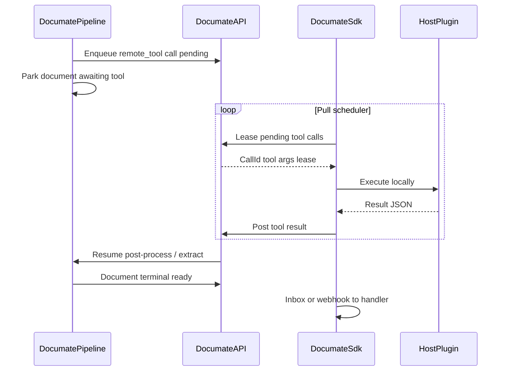

# Documate SDK — NuGet Integration Package (Exploration)

> **Status:** Exploration — Phase 1 **draft** (2026-09-01)  
> **Type:** Engineering exploration (NuGet client + host-side QMS + plugin bridge); product backlog §7 is recorded here for master-plan later phases — **Decision Required** whether to split product track  
> **Upstream:** [01-project-exploration-mental-design.md](./01-project-exploration-mental-design.md) §3.1 (white-label / SDK); [resources/documate_complete_chat_history.md](../../resources/documate_complete_chat_history.md); External `/api/v1` surface; [09-simplicity-documate-v3-client-upgrade-exploration.md](./09-simplicity-documate-v3-client-upgrade-exploration.md) (first consumer; Round 1 = direct HTTP, SDK later)  
> **Downstream:** Phase 2 implementation plan → Phase 3 dispatch queue (**only after this exploration is verified**)  
> **Created:** 2026-09-01  
> **Note on numbering:** Plan index already used `08` (browser extension) and `09` (Simplicity upgrade); this file is **`10-documate-sdk-exploration.md`**.

**Goal:** Finalize **what** belongs in a **Documate.Sdk** NuGet package so host products (Simplicity first, then other ERPs) can integrate Documate with minimal host-side plumbing — typed API client, self-contained queue management, schedulers, and a pull-based plugin bridge between Documate agents and host-local tools — without competing with the host ERP as system of record.

---

## Planning flow

| Phase | This document |
|-------|----------------|
| 1 — Exploration | **This file** |
| 2 — Implementation plan | Only after capability bands, bridge design, and Decision Required items are locked (or explicitly deferred) |
| 3 — Dispatch queue | New DQ wave(s) — decided in Phase 2; likely spans SDK package + Documate API server prerequisites |

**Note:** Per governance, Phase 2 and Phase 3 are **separate** deliverables. This file does **not** contain implementation steps or DQ items.

---

## 1. Problem Framing

### 1.1 Why a NuGet SDK

Integrating Documate today means every host re-implements:

- HTTP against `/api/v1` (multipart upload, poll, cancel, reprocess, sync extract)
- API-key auth and per-tenant credential resolution
- Durable upload/result state across process restarts
- Polling and/or webhook handling with HMAC verification
- Retry, backoff, and dedupe (the API has **no** idempotency keys)

Simplicity already has a hand-rolled `DocumateAPI` + FluentScheduler poller against **legacy** Documate. Plan 09 covers a **Round 1** direct HTTP upgrade to v3; this exploration defines the **later** NuGet that replaces that boilerplate for Simplicity and any other consumer.

### 1.2 Strategic frame (chat handoff — locked product intent)

From [documate_complete_chat_history.md](../../resources/documate_complete_chat_history.md):

| Owner | Owns |
|-------|------|
| **ERP / host** | System of record — vendors, POs, approvals, accounting rules, **business decisions** |
| **Documate** | System of understanding — extract, structure, normalize, verify, learn from documents |
| **SDK** | Bridge — reliable delivery of system-ready data **into** the host; optional **pull** of host plugins so Documate can enrich without bulk ERP data export |

**Do not** turn Documate into an ERP-adjacent decision engine that requires customers to expose master data and write-back permissions. The SDK exists so hosts keep decisions local while Documate gets **just enough** controlled access (plugins) when enrichment needs host context (e.g. supplier lookup).

Document Memory and related moat features become **much stronger** when the host can answer lookups via plugins without shipping the ERP database to Documate.

### 1.3 Why agents and plugins are different systems

| System | Today | Gap |
|--------|-------|-----|
| Documate Agent | SaaS: schema, instructions, LLM extract, in-process post-process tools | Tools are `IPlatformMcpTool` **in-process only** — not customer ERP code |
| Host ERP plugins | Live inside Simplicity / other products | No remote contract; Documate cannot call them |
| SDK | Does not exist | Must be the **bridge**: Documate parks a remote tool call; host SDK pulls, executes, posts result |

Naming note: Documate’s “internal MCP” is **not** Model Context Protocol over the wire. Customer remote tools need a **new** lease/result HTTP contract (see §5).

### 1.4 Why it hurts without an SDK

| Concern | Why it hurts |
|---------|----------------|
| Every host reinvents reliability | Poll loops, outbox, webhook HMAC, duplicate delivery |
| Simplicity TFM | `netcoreapp3.1` — cannot take a `net10.0`-only package |
| Plugin enrichment | Document Memory / master-data match need host answers without ERP dump |
| Auth migration | Legacy user/password vs v3 API keys |
| No client | No NuGet, no generated OpenAPI client for `/api/v1` |

---

## 2. Scope

### 2.1 In scope (this exploration)

- Capability inventory for **Documate.Sdk** (what the package contains)
- Self-contained **QMS** (Queue Management System) design constraints
- Pull-based **plugin bridge** design + Documate **server prerequisites**
- Target frameworks, first-consumer (Simplicity) fit
- Ultimate feature backlog for **later master-plan phases** (platform and/or SDK)
- Open questions / Decision Required for Phase 2

### 2.2 Out of scope (this exploration)

- Implementation plan, dispatch queue, or production code
- Replacing Plan 09 Round 1 (direct HTTP) — SDK is a **later** delivery relative to that path
- Implementing Document Memory / HITL / Ask Documate in Core (listed in §7 only)
- Changing External API behavior except identifying **required** server gaps for the bridge

### 2.3 Explicitly deferred to later phases

| Item | Notes |
|------|--------|
| Document Memory runtime | Platform; SDK may later feed corrections / lookups |
| True in-extract LLM tool-calling | Distinct from post-extract remote steps — Decision Required |
| White-label embedded UI | Plan 01; not NuGet core |
| Public OpenAPI + generated multi-language clients | Eng follow-on after C# SDK shape locks |

### 2.4 Locked by developer (2026-09-01)

| Decision | Choice |
|----------|--------|
| **QMS** | Queue Management System — **SDK-owned persistence**; must **not** use host DB or host job infra; ideally host is unaware of internal QMS workings |
| **Plugin bridge** | **Pull** model — SDK polls Documate for pending tool calls, runs host plugins locally, posts results; no inbound ports required on ERP |
| **TFM** | **`netstandard2.0` floor** (Simplicity `netcoreapp3.1`) **plus** a modern target (e.g. `net8.0` / `net10.0`) for ASP.NET Core hosts |

**Not locked:** concrete persistence engine (SQLite vs LiteDB vs other) — see Decision Required D1.

---

## 3. Current-State Findings

### 3.1 Documate External API (`/api/v1`)

Controllers under `apps/api/Modules/External/**` — **9 endpoints**, API-key auth:

| # | Method | Route | Success |
|---|--------|-------|---------|
| 1 | POST | `/api/v1/queues/{queueId}/files` | 202 — async multi-file upload |
| 2 | POST | `/api/v1/queues/{queueId}/extract` | 200/409 — sync-wait single file |
| 3 | GET | `/api/v1/queues/{queueId}/files` | 200 — list (max 200) |
| 4 | GET | `/api/v1/files/{fileId}` | 200 |
| 5 | POST | `/api/v1/files/{fileId}/cancel` | 200 |
| 6 | POST | `/api/v1/files/{fileId}/reprocess` | 202 — new file |
| 7 | GET | `/api/v1/queues/{queueId}/documents` | 200 — list (max 200) |
| 8 | GET | `/api/v1/documents/{documentId}` | 200 — includes `resultJson` |
| 9 | POST | `/api/v1/documents/{documentId}/cancel` | 200 |

**Auth:** `X-Api-Key` or `Authorization: ApiKey …`; key format `dm_{8hex}_{48hex}`; SHA-256 hash stored; business scoped from key. **No scopes, rate limits, or idempotency keys.**

**Webhooks:** `document.terminal` POST to queue URL; snake_case body; `X-Documate-Signature: sha256=<hmac>`; headers `X-Documate-Event`, `X-Documate-Delivery`; max 5 attempts (30/60/120/300/600s). **Skipped** for `api_sync` source.

**Gates:** async ≤ 200 MB; sync HTTP ≤ 50 MB but effective **5 MB / 3 pages** (`PipelineOptions`); gate violations can surface as **500** — SDK should pre-check client-side.

**Errors:** ad-hoc `{ error }` — not ProblemDetails. OpenAPI at `/openapi/v1.json` **Development only**; Swagger UI not wired. **No existing NuGet SDK.**

**Status keys (public):**  
File: `received`, `processing`, `ready`, `partial_ready`, `failed`, `rejected`, `cancelled`  
Document: `received`, `processing`, `ready`, `failed`, `rejected`, `cancelled`

### 3.2 Agent + “MCP” post-process (plugin reality)

| Fact | Implication for SDK |
|------|---------------------|
| `IPlatformMcpTool` + `InternalMcpHost` — in-process DI only | No transport for ERP plugins |
| Tools mutate `JsonObject` in place; no descriptor schema / return contract | Remote tools need new request/response shapes |
| Workflow DSL: `{"version":1,"steps":[{"tool":"...","fields":[...]}]}` | Can extend with `remote_tool` step type |
| LLM extract is one-shot HTTP — **no** function calling | Remote enrichment needs **pipeline park/resume** or bounded wait |
| Memory / corrections / confidence / provenance | **Not in runtime code** — product docs / chat only |

Key files: `Infrastructure/PostProcess/InternalMcpHost.cs`, `PlatformMcpTools.cs`, `AgentPostProcessRunner.cs`, `Pipeline/Stages/DocumentExtractStage.cs`.

### 3.3 Simplicity as first consumer

| Dimension | State |
|-----------|--------|
| Host | `s4b-simplicitycloud-v9`, ASP.NET Core **`netcoreapp3.1`**, C# 8, x86 Debug preferred |
| Existing client | `Commons/DocumateAPI.cs` + `SimAi.Models` — legacy auth `auth/login` |
| Orchestration | `RossumRepository` — upload → poll/webhook → import SI/CN/DN/PO |
| Scheduling | FluentScheduler 5.5.1 — 1-minute poll |
| Credentials | Per-tenant `CldSettings` (`RossumUserId`, `RossumUserPassword`, `SimApiEndPoint`) — **not** appsettings |
| NuGet | Public nuget.org; has `Universal.Rossum.Client`; no private feed in-repo |
| Plan 09 | Round 1 = **direct HTTP** to v3; **SDK NuGet = later** |

### 3.4 Repo packaging

- Solution: `Documate.slnx` — currently `apps/api` + `tests/api` only  
- No `packages/` or SDK project yet  
- Architecture notes future OpenAPI-generated clients (`docs/architecture/patterns/openapi-and-clients.md`)

---

## 4. SDK Capability Inventory

Grouped into **delivery bands** (product phases for the SDK itself — not governance Phase 1/2/3). Band A–C are the **basic** package; Band D+ folds into master plan later.

### Band A — Core transport client (basic)

| Capability | Purpose |
|------------|---------|
| Typed `DocumateClient` for all 9 `/api/v1` operations | Replace hand-rolled HTTP |
| API-key auth (`X-Api-Key`) | Match External auth |
| Pluggable `IDocumateCredentialProvider` | Host DB / secrets (Simplicity `CldSettings`) |
| Multipart upload helpers + optional sync extract | Async + sync paths |
| Client-side gate pre-checks (size/pages) | Avoid opaque 500s |
| Poll helpers for file/document terminal status | Status key awareness |
| Cancel / reprocess wrappers | Ops parity |
| Error mapping to typed exceptions | Ad-hoc `{ error }` → usable faults |
| `netstandard2.0` + modern multi-target | Simplicity + modern hosts |
| Fake / in-memory harness | Host unit tests without live API |

### Band B — Self-contained QMS + schedulers (basic)

**QMS purpose:** Durable, self-driving upload → poll/webhook → host delivery, so the host calls `Submit` once and later receives results via **one** callback. Host should not own outbox tables or poll loops.

```text
Host ERP
   │ submit(file)
   ▼
┌─────────────────────────────────────┐
│  Documate.Sdk QMS (SDK-owned store) │
│  Outbox ──upload pump──► Documate   │
│  Inbox  ◄──status poll── Documate   │
│  Inbox  ◄──webhook────── Documate   │
│         └──► IDocumentResultHandler │
└─────────────────────────────────────┘
```

| Capability | Purpose |
|------------|---------|
| **Outbox** | Persist pending uploads; pump to `POST …/files` with retry/backoff |
| **Inbox** | Track in-flight File/Document IDs until terminal |
| **Leasing** | Multi-instance safe (web farm) — one worker owns a row |
| **Backoff / poison** | Exponential retry; dead-letter after N failures |
| **Dedupe** | Compensate for missing API idempotency keys |
| **Retention / purge** | Scheduler cleans completed rows |
| Schedulers: upload pump, status poll, reconcile, purge | Built-in; **not** host FluentScheduler/Hangfire |
| Single host hook: `IDocumentResultHandler` | Import path into ERP once |
| Webhook receiver (HMAC verify) | Same handler as poll path |
| **SDK-owned store** behind `IDocumateStore` | Never host business DB (locked constraint) |

**Persistence:** mechanism **not locked** (Decision Required D1). Constraint locked: SDK-owned, pluggable, host-unaware.

### Band C — Plugin bridge (basic for “agent ↔ ERP”)

| Capability | Purpose |
|------------|---------|
| Host registers named plugins (`IDocumateHostPlugin`) | Local ERP tools |
| Tool-call **pull** scheduler | Poll Documate for leased calls |
| Execute plugin locally; post result | No inbound ERP ports |
| Allow-list / consent per tool | Confused-deputy mitigation |
| Connector auth (key reuse vs scoped — Decision Required) | Secure bridge |

Requires **Documate server** work not present today — see §5.

### Band D — Host packaging helpers (optional / modern TFM)

| Capability | Purpose |
|------------|---------|
| `AddDocumateSdk(...)` DI extensions | ASP.NET Core hosts |
| HostedService wrappers for schedulers | Modern hosts |
| AspNetCore webhook endpoint mapper | Map HMAC receiver |

Legacy `netcoreapp3.1` may use manual registration (Decision Required D2 package split).

### Band E+ — Later (see §7)

Document Memory feedback, typed Output Contracts, master-data plugins as first-class patterns, delivery adapters, etc.

---

## 5. Plugin Bridge Design (Pull)

### 5.1 Sequence (target)



### 5.2 Host-side (SDK)

1. Host registers plugins: name, description, JSON arg schema (optional), `ExecuteAsync`.
2. On start, SDK may **register** tool catalog with Documate (heartbeat + capabilities).
3. Pull loop: lease N pending calls → execute → post success/failure → release/complete.
4. Timeouts: if lease expires, another SDK instance may reclaim (at-least-once → plugins must be idempotent).

### 5.3 Server-side prerequisites (do not exist today)

| Prerequisite | Why |
|--------------|-----|
| Tool registration API (per Business / connector) | Discover which host tools exist |
| Tool-call queue + **lease** + **result** endpoints | Pull model |
| Workflow step type e.g. `remote_tool` | Distinct from in-process `normalize_date` |
| Pipeline **park / resume** (or bounded wait) | Extract/post-process cannot block Hangfire forever |
| Auth for connector (API key vs scoped connector key) | Decision Required D5 |
| Audit of remote invocations | Security / support |

### 5.4 Timing model — Decision Required D4

| Option | Meaning |
|--------|---------|
| **Post-extract only** | Remote tools run like today’s post-process after LLM JSON exists |
| **In-extract tool-calling** | LLM requests tools mid-prompt — larger Core change |

Recommendation for first bridge ship: **post-extract remote steps** (closer to current `AgentPostProcessRunner`), then optionally LLM tool-calling later.

### 5.5 Park vs wait — Decision Required D3

| Option | Trade-off |
|--------|-----------|
| **Park/resume** | Document state `awaiting_host_tool`; Hangfire job ends; resume on result — scalable |
| **Bounded in-stage wait** | Simpler but ties worker thread/job; bad for slow ERP plugins |

Recommendation: **park/resume**.

---

## 6. Risks and Constraints

| Risk | Notes |
|------|--------|
| Pipeline parking is a **Core** change | SDK Band C blocked until server leases exist |
| `netstandard2.0` API surface limits | Prefer HttpClient patterns that work on both TFMs |
| SQLite native assets + Simplicity **x86** IIS | If SQLite chosen for D1 |
| Web-farm file locking | Single SQLite file + multi-instance → need leasing or per-instance DB |
| Confused deputy | Remotely triggered host plugins — allow-list + auth mandatory |
| At-least-once delivery | Handler and plugins must tolerate duplicates |
| SDK vs API drift | Versioning / OpenAPI contract tests |
| Simplicity auth migration | Legacy login → API keys (Plan 09) |
| Plan 09 vs this plan | Round 1 direct HTTP must not be blocked; SDK is additive later |
| Engineering vs product doc mix | §7 backlog may need a separate product exploration (D8) |

---

## 7. Ultimate Feature Backlog (later master-plan phases)

Features that increase Documate’s importance / switching cost. Tags: **P** = primarily platform (Documate SaaS), **S** = primarily SDK/host bridge, **P+S** = both.

Aligned to chat strategy: **do not own ERP decisions**; own understanding + controlled host plugins for enrichment.

| # | Feature | Tag | Why it matters |
|---|---------|-----|----------------|
| 1 | **Document Memory** — supplier / document / field profiles, terminology maps, layouts, relationships, versions, anomaly baselines | P (+ S later for correction sync) | Compounding moat from documents + corrections — not ERP dump |
| 2 | **Correction feedback loop** — UI/API to push field corrections; train memory | P+S | Host or Documate UI captures truth |
| 3 | **Field confidence + provenance** — evidence spans, scores | P | Enables selective human review |
| 4 | **Output Contracts** — required fields/rules; optional generated typed C# models in SDK | P+S | System-ready payloads match host expectations |
| 5 | **Master-data lookup plugins** — vendor/PO match via pull bridge | S (+ P orchestration) | Enrichment **without** exposing ERP DB |
| 6 | **Confidence-driven HITL / exception routing** | P | Review only uncertain fields |
| 7 | **Duplicate detection + intra-submission reconciliation** | P | Multi-attachment consistency |
| 8 | **Delivery adapters** — CSV/XML/Excel/SFTP/webhook variants | P+S | Meet host ingestion formats |
| 9 | **Semantic split / classify + table understanding** | P | Harder than DIY LLM glue |
| 10 | **Ask Documate** — Q&A over business document corpus | P | Sticky knowledge product |
| 11 | **Analytics + audit trail** | P | Ops trust / compliance |
| 12 | **White-label / embedded UI** | P | Plan 01; not core NuGet |
| 13 | **Rate limits + idempotency keys on `/api/v1`** | P | Makes QMS safer |
| 14 | **OpenAPI always-on + multi-language clients** | P+S | Broader ecosystem |

**Suggested master-plan phase folding (draft — not locked):**

| Master phase | Includes |
|--------------|----------|
| After Plan 09 Round 1 | SDK Bands A–B (client + QMS) |
| Next | Server tool lease + SDK Band C (plugin bridge) |
| Later product waves | §7 items 1–7, 9–11 (Document Memory first as moat) |
| Ecosystem | §7 items 8, 12–14 |

---

## 8. Open Questions / Decision Required

### D1 — SDK-owned store mechanism

| Option | Pros | Cons |
|--------|------|------|
| **A. Embedded SQLite** in configured data directory (recommended default) | Zero host DB; transactional; common | Native bits + x86; web-farm locking |
| **B. LiteDB / pure-managed file store** | No native deps; friendlier to x86 IIS | Weaker concurrency story |
| **C. SDK-owned tables in host DB** | Ops familiar | Violates “host unaware / min dependency” — **deprioritized** |
| **D. Pluggable only** — ship A+B, pick default in Phase 2 | Flexible | Delays a default |

**Constraint (locked):** never business tables of the host; always behind `IDocumateStore`.

### D2 — Package split

| Option | Notes |
|--------|-------|
| **A. Monolith** `Documate.Sdk` | Simplest consume |
| **B. Split** `Documate.Sdk` + `.Queue` + `.Plugins` + `.AspNetCore` | Smaller refs; clearer TFM boundaries |

### D3 — Remote tool execution model

| Option | Notes |
|--------|-------|
| **A. Park/resume** (recommended) | Scalable |
| **B. Bounded in-stage wait** | Simpler, fragile under load |

### D4 — Tool-call timing

| Option | Notes |
|--------|-------|
| **A. Post-extract remote steps only** (recommended first) | Fits current runner |
| **B. In-extract LLM tool-calling** | Larger; defer |

### D5 — Bridge auth

| Option | Notes |
|--------|-------|
| **A. Reuse business API key** | Simple |
| **B. Separate scoped connector key** + per-tool allow-list (recommended direction) | Least privilege |

### D6 — Distribution

| Option | Notes |
|--------|-------|
| **A. nuget.org public** | Easy adoption |
| **B. Private feed** | Control; Simplicity needs feed config |

### D7 — Simplicity migration shape (when SDK lands)

| Option | Notes |
|--------|-------|
| **A. Keep `IDocumateAPI` facade** over SDK | Minimal churn |
| **B. Refactor `RossumRepository` to SDK types directly** | Cleaner long-term |

Coordinate with [09-simplicity-documate-v3-client-upgrade-exploration.md](./09-simplicity-documate-v3-client-upgrade-exploration.md).

### D8 — Doc split for §7 backlog

| Option | Notes |
|--------|-------|
| **A. Keep §7 in this engineering exploration** | One place for now |
| **B. Spin product-track exploration** (e.g. Document Memory) | Matches governance tracks |

### Other opens

| ID | Question |
|----|----------|
| O1 | Default poll intervals / lease TTLs? |
| O2 | Should sync extract use QMS at all, or bypass to direct client? |
| O3 | Multi-tenant SDK process (one process, many API keys) — required for Simplicity? |
| O4 | Blob staging for outbox — store file bytes in SDK store vs path reference only? |

---

## 9. Recommended Direction

1. **Ship order:** Band A (typed client) → Band B (QMS + schedulers + webhook) → Band C (pull plugin bridge) after server leases exist.  
2. **Host contract:** Prefer one `IDocumentResultHandler`; hide QMS internals.  
3. **Bridge:** Pull + park/resume + post-extract `remote_tool` first.  
4. **TFM:** `netstandard2.0` + modern; AspNetCore helpers on modern only.  
5. **Persistence:** Recommend SQLite behind `IDocumateStore`, but **do not lock** until D1 answers x86 + web-farm.  
6. **Simplicity:** Do not block Plan 09 Round 1; SDK replaces/facades later (D7).  
7. **Moat backlog:** Document Memory + correction loop + master-data plugins via bridge — fold into master plan as later phases; consider D8 product-track split for Memory.

---

## 10. Exploration Exit Criteria

Phase 1 is complete when developer has:

- [ ] Verified current-state findings (§3) against live API/code  
- [ ] Approved Band A–C as the **basic** SDK scope (or amended)  
- [ ] Locked or explicitly deferred D1–D8  
- [ ] Agreed §7 backlog membership and whether it stays here or splits (D8)  
- [ ] Approved readiness for **Phase 2 implementation plan** (SDK package + server prerequisites called out)

---

## Agent output contract

### Finalized Decisions

- QMS = Queue Management System with **SDK-owned** persistence; host DB/job infra not used; host ideally unaware of QMS internals.  
- Plugin bridge = **pull** model.  
- TFM = **`netstandard2.0` + modern** multi-target.  
- Strategic boundary: Documate = understanding; ERP = decisions; SDK = bridge.  
- File identity: this exploration is **`10-documate-sdk-exploration.md`** (08/09 already allocated).

### Pending Decisions

- D1 store mechanism; D2 package split; D3 park vs wait; D4 tool timing; D5 bridge auth; D6 distribution; D7 Simplicity facade; D8 product-doc split; O1–O4.

### Assumptions

- Plan 09 Round 1 (direct HTTP) ships before or in parallel with SDK Band A, without waiting for QMS.  
- First production consumer remains Simplicity Cloud.  
- External `/api/v1` remains the only public integration surface for the client band.  
- In-process platform MCP tools remain for Documate-side normalize; customer tools are remote via bridge.

### Risks

- Band C blocked on Core park/resume + lease APIs.  
- Persistence choice can break Simplicity x86 / multi-instance hosting.  
- Mixing large product backlog (§7) in an engineering exploration may blur tracks (D8).  
- At-least-once semantics if hosts assume exactly-once import.

### Readiness

**Blocked** on developer verification of findings and closure (or explicit deferral) of Decision Required D1–D8 before Phase 2 implementation plan.

---

**Next gate:** Review this exploration, answer opens, then approve Phase 2 (implementation plan only — no dispatch queue in the same step).
