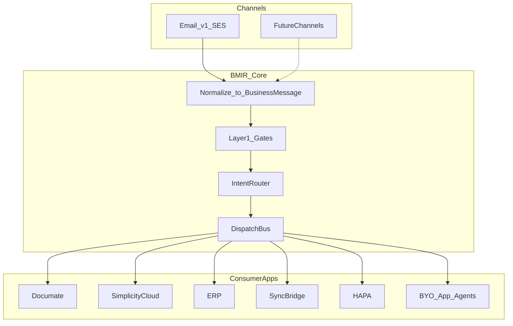

# Business Message Intake & Routing Platform (BMIR) — Exploration

> **Status:** Exploration — Phase 1 draft (BMIR direction locked; opens remain)  
> **Type:** Product / mental design (multi-app platform; not Documate CQRS engineering)  
> **Upstream:** [01-project-exploration-mental-design.md](./01-project-exploration-mental-design.md) §14 (email gates); [02-document-queue-design.md](./02-document-queue-design.md) §5.2; [03-documate-v3-implementation-plan.md](./03-documate-v3-implementation-plan.md) Decision D / DQ-1201–1202; Simplicity OCR plans (email as candidate channel 4a)  
> **Downstream:** Phase 2 implementation plan only after developer verifies this doc and closes critical opens  
> **Created:** 2026-09-04  

**Goal of this doc:** Frame a **Business Message Intake & Routing Platform** whose first channel is email—not a generic email-agent OS—so Documate, Simplicity Cloud, ERP, SyncBridge, HAPA, and BYO apps can share intake, gates, routing, and handoff while keeping domain agents in each product.

**Locked framing:** Do **not** build a generic “email agent platform” first. Build BMIR; email (SES, forwards, rules, add-ons, optional OAuth sync) is the **v1 transport**. The product core is normalized business messages, routes, and dispatch.

---

## Planning flow

| Phase | This document |
|-------|----------------|
| 1 — Exploration | **This file** |
| 2 — Implementation plan | Only after developer verifies + answers critical opens |
| 3 — Dispatch queue | Only after Phase 2 approved |

---

## 1. Problem Framing

Customers (e.g. **MCM**) receive inbound **business messages**—today mostly email; later possibly WhatsApp, portal drops, scans, EDI—and need them routed to the right **app** and **purpose**:

| Destination | Example purpose |
|-------------|-----------------|
| Simplicity Cloud | DMS store, team share, Documate-integrated OCR upload |
| Documate | Document-type → Agent workflow (invoice, DN, PO, …) |
| ERP / SyncBridge / HAPA | App-specific intake / sync / filing |
| Future supplier agents | Separate mailboxes for invoices, DNs, PO replies, statements, balance requests |

Email is the urgent first channel (manual forward, Google Workspace / Microsoft 365 rules, webmail, Gmail/Outlook add-ons, optional credentialed mailbox sync). The durable product loop is:

**intake → normalize to Business Message → Layer-1 gates → intent route → dispatch**, with **consumer apps owning domain agents** that finish the job.

### Customer scenario (MCM)

1. MCM uses Simplicity Cloud; Simplicity integrates Documate.  
2. Staff may forward mail **to Simplicity** for DMS / team share **or** toward Documate for a **specific document-type workflow**.  
3. One user may use multiple solutions → destination picker / purpose aliases matter.  
4. MCM also wants dedicated supplier addresses (invoices, delivery notes, PO replies, statements) automated via agents that may then call other products’ agents.

### Why not only Documate Queue email?

Documate already designs email as a **Queue capability secret** inside one Business ([Plan 01 §14](./01-project-exploration-mental-design.md)). MCM’s multi-app, multi-purpose routing **outgrows** Queue-as-mailbox as the sole platform. Documate remains a first-class **consumer**; its gates become a **destination contract pattern**, not the whole product.

### Why not an “email agent platform” first?

That overfits transport, invites email-only agent sprawl, and makes other agentic teams less likely to adopt. BMIR sells **intake + routing + handoff**; finishing agents live in Documate / Simplicity / BYO.

---

## 2. Scope

### In scope (Phase 1 — ideas and guidance)

- **Product core:** Business Message model; Platform → App → Client → Route/Purpose tenancy; gates; intent router; dispatch/handoff contract.  
- **First channel = email:** Outlook, Gmail, Google Workspace, Office 365 web, third-party webmail, manual forward; **AWS SES** as intake mailbox transport; rules / add-on / OAuth assist patterns.  
- **Explicit non-goal:** do not design an email-centric agent marketplace or email-only autonomous OS as the primary product.  
- MCM multi-app routing; purpose aliases; supplier mailboxes; Hub routes, product agents complete.  
- Dual audience: managed multi-app SaaS **and** embeddable intake/routing for teams with BYO agents.  
- Relationship to Documate Plan 01 §14 / DQ-1201–1202 (consume vs replace vs parallel).  
- Risks: channel lock-in, unauthenticated email, credential custody, ownership, adoption.

### Out of scope (Phase 1)

- Implementation architecture, SES Terraform, add-on code, dispatch queues.  
- Building non-email channels (only stub future-channel slots).  
- Final product name / branding.  
- Executing Documate DQ-1201 (remains Documate’s path unless Phase 2 redirects it).  
- Engineering/CQRS folder conventions (owned by `docs/architecture/`).

---

## 3. Current-State Findings

| Area | Finding | Key refs |
|------|---------|----------|
| Documate email design | Gates → intake-decision agent → Files; allowlist; ambiguity → reject | Plan 01 §14; Plan 02 §5.2 |
| Documate code | Mint address, allowlist APIs/UI; **no SES/IMAP receiver** | `EmailIntakeOptions`, Queues email settings, `OpsQueue*` |
| Documate backlog | Stub first (**DQ-1201** ready); real provider later (**DQ-1202** parked) | Plan 03 Decision D |
| Simplicity | Outbound SMTP only; supplier docs via upload / portal / desktop | Rossum / DocumateV3 clients |
| Simplicity plans | Email inbox ingest = candidate channel **4a**, not built | `dev-infra-s4b` OCR / supplier-doc plans |
| Cross-product today | HTTP External `/api/v1` (+ later SDK Plan 10) | Not a shared message bridge |
| White-label | Later Documate goal; keep APIs clean | Plan 01 §3.1 |

**Gap summary:** Portfolio has strong **per-product** document pipelines and a designed Documate email channel, but **no multi-app Business Message intake / routing / handoff** product.

---

## 4. Risks and Constraints

| Risk | Why it matters | Mitigation posture |
|------|----------------|--------------------|
| Drift into “email agent OS” | Other teams reject closed orchestrator; hard to add channels | Keep APIs message/route-first; agents finish work in consumers |
| Unauthenticated email abuse | Spoof, flood, data poison | Plan 01 Layer-1 gates; capability-secret addresses; allowlist before selling hard; email ≠ payment authority |
| Credential custody (OAuth sync) | Highest trust / compliance bar | Prefer forward-only MVP; OAuth later with scoped consent + revoke UX |
| Split-brain SES | Documate DQ-1202 **and** BMIR both own inbound | Decide ownership before Phase 2 (open Q3) |
| Documate-centric tenancy | Blocks Simplicity / ERP / BYO | App → Client → Route at platform layer; Documate Queue is a **destination mapping**, not the Hub identity |
| Over-abstract future channels | Delays email MVP | Stub future channels; stabilize **minimum Business Message** for v1 only |
| Compliance | Retention, PII, cross-app residency | Per-App retention policies; audit `channel=email`; clear handoff boundaries |

---

## 5. Open Questions

Developer must answer before Phase 2. Critical items marked ★.

| # | Question | Options (concrete) |
|---|----------|-------------------|
| ★ Q1 | **Product home / ownership** | A) Separate brand & deployable · B) Documate-owned shared service white-labeled to apps |
| ★ Q2 | **MVP email set** | A) SES forward-only (+ guided rules docs) · B) Include Gmail/Outlook add-on · C) Include OAuth mailbox sync |
| ★ Q3 | **Documate near-term email** | A) Pause/redirect DQ-1201–1202 toward BMIR · B) Ship Documate stub in parallel · C) DQ-1201 stub only; real SES only via BMIR |
| ★ Q4 | **Tenancy source of truth** | A) New BMIR identity · B) Reuse Iden · C) Map per-app ids (e.g. Simplicity `ProjectId`) without new IdP |
| Q5 | **First consumer after Documate** | A) Simplicity supplier-doc email (MCM) · B) HAPA · C) Other |
| ★ Q6 | **Business Message minimum schema (v1)** | What fields must be stable before a second channel? (see §6.2 candidate) |

---

## 6. Recommended Direction

### 6.1 Working model: BMIR

### 6.2 Core (channel-agnostic)

1. **Business Message** — normalized payload after channel adapters. Candidate v1 fields (Q6 locks exact set):  
   - `messageId` (platform idempotency)  
   - `channel` (`email` | future)  
   - `channelNativeId` (e.g. email `Message-Id`)  
   - `receivedAt`  
   - `from` / `to` / `cc` (normalized addresses)  
   - `subject` / `bodyText` / `bodyHtml` (channel equivalents)  
   - `attachments[]` (blob refs + filename + MIME + size)  
   - `appId` / `clientId` / `routeId` (resolved or pending)  
   - `gateOutcome` / `routerDecision` (audit)  
2. **Tenancy** — Platform → **App** (Documate, Simplicity, ERP, SyncBridge, HAPA) → **Client** (e.g. MCM) → **Route / Purpose**. Not locked to Documate Queue IDs at the platform layer; Documate Queue Guid is a **destination attribute** when App = Documate.  
3. **Gates** — enable/disable, size/type/rate limits, allowlist (exact + domain), kill switch. Reuse Plan 01 Layer-1 ideas as destination-safe patterns.  
4. **Intent router** — accept / reject; choose App + Client + Purpose; then **hand off**. Does **not** own Documate extract, Simplicity DMS filing, or supplier AP logic.  
5. **Pluggable decision** — three adoption modes (below).

### 6.3 Email as first channel (v1 transport, not product identity)

| Mechanism | Role |
|-----------|------|
| **AWS SES inbound** | Primary intake mailbox transport (per locked preference) |
| **Capability-secret + purpose aliases** | e.g. `mcm-invoices@…`, `mcm-documate-po@…` → App + Client + Route |
| **Manual / third-party webmail** | Forward to SES address (same backend) |
| **Google Workspace / M365** | Guided transport/inbox rules pointing at SES; optional Graph/Gmail API rule deploy with admin consent (later) |
| **Gmail / Outlook add-on** | Authenticated “Send to {App}” + destination picker for multi-solution users |
| **OAuth mailbox sync** | Highest trust bar; not required for MVP unless Q2 says otherwise |

Map every email artifact into **Business Message** before routing so a later WhatsApp/portal channel reuses BMIR core.

#### Email channel / assist matrix (v1)

| Channel | How users send | Platform help |
|---------|----------------|---------------|
| Manual forward | Forward/attach to SES address | Copy address, QR, per-purpose aliases |
| Google Workspace / M365 | Transport/inbox rules | Setup wizard + docs; optional API rule deploy later |
| Gmail / Outlook web | Rules or add-on | Add-on: pick App + Client + Route |
| Third-party webmail | Manual forward to SES | Same as manual |
| Credential sync | OAuth mailbox watch | Explicit consent, scoped `mail.read`, revoke UX |

### 6.4 Agent handoff model

| Layer | Owns | Does not own |
|-------|------|--------------|
| **BMIR Intent Router** | Accept/reject; App/Client/Purpose; dispatch | Domain extract, ERP posting, DMS taxonomy |
| **Consumer System/Customer Agents** | Documate pipeline, Simplicity import, supplier AP, team share | Raw SES receive / multi-app addressing |
| **BYO agents** | Team-specific rules + internal tools | Optional: they may replace BMIR router via Events-only / Embed |

**Handoff contract (conceptual):** signed webhook / API / event carrying Business Message refs + router decision + blob URIs. Consumer returns ack / reject / correlation id.

### 6.5 Adoption modes (other agentic teams)

| Mode | What they get | Who decides routing |
|------|---------------|---------------------|
| **Managed** | Ingress + gates + BMIR router + dispatch | BMIR |
| **Events-only** | Normalized Business Message stream after gates | Consumer |
| **Embed / SDK + BYO agents** | Reuse SES/add-ons/gates/dedupe/compliance | Consumer agents |

This answers the “opposite side” concern: teams already doing agentic work can treat BMIR as an **internal intake mechanism** without adopting a closed email-agent OS.

### 6.6 Relationship to Documate email (DQ-1201 / 1202)

| Stance | Implication |
|--------|-------------|
| Documate as **consumer** | BMIR dispatches into External `/api/v1` or a future “intake from BMIR” contract; Queue + allowlist remain Documate destination config |
| Plan 01 §14 | Remains the **security/gates pattern** for email-shaped messages; BMIR generalizes the pattern to Business Message |
| DQ-1201 stub | May still validate Documate intake-decision agent **inside** Documate, or wait for BMIR (★ Q3) |
| DQ-1202 real SES | Prefer **one** SES owner (BMIR) to avoid split-brain |

### 6.7 Explicit non-goals (Phase 1 product)

- Email-agent marketplace / multi-agent email OS as the product identity.  
- Building WhatsApp / EDI / portal channels in v1 (slots only).  
- Replacing Documate QueueRoute / Agent extract design.  
- Final branding.

---

## 7. Exploration Exit Criteria

Phase 1 is **complete** when this document includes (and it now does):

- [x] Problem framing + MCM scenarios  
- [x] Current-state findings (Documate + Simplicity)  
- [x] Recommended **BMIR** direction with explicit non-goal: not an email-agent platform first  
- [x] Email as first channel (matrix + SES) + stub for future channels  
- [x] Agent handoff model (BMIR router vs consumer agents)  
- [x] Dual-audience integration modes (managed / events / BYO)  
- [x] Risks, open questions, exit criteria  
- [x] Output contract below  

**Gate:** Developer reviews, answers ★ opens (Q1–Q4, Q6), then approves **Phase 2** (implementation plan only). Do **not** write implementation plan or DQ until that approval.

---

## Output contract

### Finalized Decisions

| ID | Decision |
|----|----------|
| F1 | Product is **BMIR** (Business Message Intake & Routing), not an email-agent platform first |
| F2 | **First channel = email**; AWS SES preferred for intake mailboxes |
| F3 | Core loop: normalize → gates → intent route → dispatch; **consumer apps own finishing agents** |
| F4 | Documate is a **first-class consumer**, not the sole mailbox product; Plan 01 §14 informs gates |
| F5 | Three adoption modes: Managed · Events-only · Embed/SDK + BYO |
| F6 | This exploration is **product track**; engineering layout deferred to Phase 2 / architecture docs |

### Pending Decisions

| ID | Decision | Blocker for |
|----|----------|-------------|
| P1 | Product home / ownership (Q1) | Phase 2 packaging |
| P2 | MVP email channel set (Q2) | Phase 2 waves |
| P3 | Documate DQ-1201/1202 vs BMIR (Q3) | Avoid split-brain |
| P4 | Tenancy SoT (Q4) | Identity & mapping |
| P5 | First non-Documate consumer (Q5) | Pilot ordering |
| P6 | Business Message v1 schema lock (Q6) | API/event contract |

### Assumptions

- Portfolio apps (Documate, Simplicity, ERP, SyncBridge, HAPA) will integrate via handoff contracts rather than each rebuilding SES/add-ons.  
- Forward-only SES is enough to prove multi-app routing before OAuth sync.  
- MCM-like clients need **purpose-level** addressing, not only per-app inboxes.  
- Other agentic teams will adopt BMIR only if routing is pluggable.

### Risks

See §4. Highest Phase-2 blockers: **ownership (Q1)**, **SES split-brain (Q3)**, **tenancy (Q4)**.

### Readiness

**Ready for next phase** — blocked only on developer verification of this exploration and answers to ★ open questions before Phase 2 starts.

---

## Changelog

| Date | Note |
|------|------|
| 2026-09-04 | Phase 1 exploration drafted: BMIR framing; email first channel; Documate/Simplicity current state; opens Q1–Q6. |
