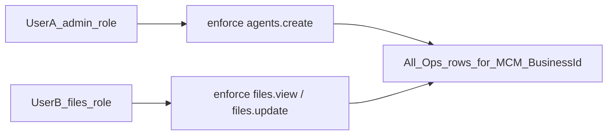
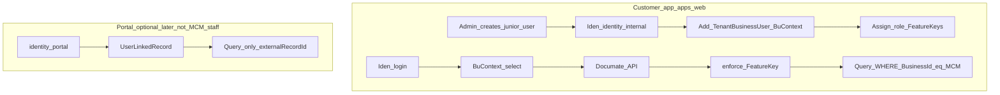
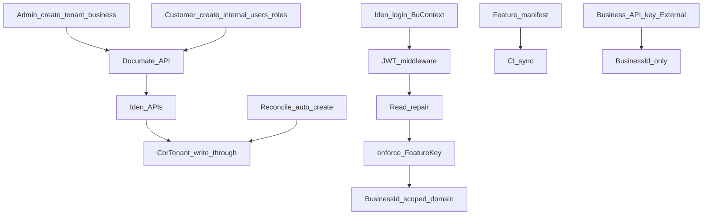

# Documate × Iden Integration — Exploration Plan (Phase 1)

| Field | Value |
|-------|--------|
| **Feature** | Live Iden integration: auth, tenancy, identities/users, FeatureKeys/permissions, CorTenant shadow sync, admin provisioning, architecture coding rules |
| **Track** | **Engineering** (Iden harness / Band 15 unpark) |
| **Module** | `apps/api`, `apps/web` (customer), `apps/admin` (platform ops UI), CI feature sync, `docs/architecture/` |
| **Iden contract** | `iden-dev-infra/docs/For-Integrators/documate-catalog-and-permissions.md` (BuContext, 2026-09-22) |
| **Related** | `docs/architecture/governance/iden-constraints.md`, `auth-wiring-placeholder.md`, Band 15 DQ-1501–1507 (parked) |
| **Status** | Phase 1 — **Exploration complete** (approved 2026-09-22) |
| **Created** | 2026-09-22 |
| **Amended** | 2026-09-22 — modules reduced (3 customer + 3 admin); Users & permissions page; catalog in impl plan |

## Planning flow

| Phase | Artifact | Status |
|-------|----------|--------|
| 1 — Exploration | **This file** | ✅ Approved 2026-09-22 |
| 2 — Implementation plan | `25-iden-integration-implementation-plan.md` | ✅ Approved 2026-09-22 |
| 3 — Dispatch queue | `25-iden-integration-dispatch-queue.md` | 🔄 Band 20 — ask which DQ |

---

## 1. Problem framing

Documate Phase 1 uses DevBypass / InterimFeGate / AdminGate / F2 API keys. Iden is the intended SoT for Tenant, TenantBusiness, identities, FeatureKeys, roles, and runtime allow/deny.

This exploration covers: Iden login, admin create tenant/business, customer-app multi-user RBAC, shadow CorTenant sync, automated FeatureKeys, architecture coding docs.

---

## 2. Scope

### In scope (exploration)

- Full Band 15–style Iden map (auth, tenancy, identities, catalog, enforce)
- Admin SPA: create Tenant + Business (Iden-first)
- Customer SPA: multi-user create with **restricted FeatureKeys** (junior vs admin)
- **Users & permissions page** (`/users`) — admin sets role/access
- Reduced modules: 3 customer + 3 admin (human-friendly display names)
- Iden login + BuContext select + silent refresh
- Shadow-copy integrity (write-through + reconcile auto-create)
- Automated FeatureKey registration (manifest + CI)
- Architecture docs for future coding
- Clarify portal vs internal for Documate’s real usage

### Out of scope

- Implementation code / DQ execution
- SyncBridge entitlement commands (consume only)
- Iden Ops / AdminGate redesign (not Documate-relevant per developer)
- Row-level “creator-only” data isolation (explicitly **not** required)

---

## 3. Current-state findings (summary)

- Auth interim only; `CorTenant` / `CorTenantBusiness` mirrors; local Guid business create possible
- No FeatureKey / enforce; Band 15 parked
- Iden guide updated: **BuContext** (`bu_context_id`, `/bu-contexts`), silent refresh, `SessionPolicies:BySoftwareKey:documate`

### Remaining Iden doc gaps (still thin)

Portal FeatureKey policy templates; check vs evaluate; validate GET vs POST; identity field names; catalog upsert algorithm; role JSON; JWKS/iss/aud; **per-business machine credentials** (see §6 Q3).

---

## 4. Expanded capabilities (locked)

### 4.1 Admin web — create Tenant / Business

Admin SPA → Documate API → Iden (`tenant:write` / `business:write`) → write-through CorTenant mirror → seed roles → Documate defaults (Queue, etc.). Never mint local Iden Guids.

### 4.2 Customer app — multi-user RBAC + Users & permissions page

**This is normal and Iden supports it. No fundamental problem.**

Example:

| User | Tenant / Business | Role (FeatureKeys) | Data they see |
|------|-------------------|--------------------|---------------|
| User A | Simplicity Cloud / MCM | Admin: agents create/update, … | **All** agents/files in that business (if FeatureKey allows) |
| User B | Same | Junior: files view/update; **no** delete; **no** agents | **All** files in that business they may view/update — **not** “only files they created” |

**How it works on Iden:**

1. Both users are **`identity_class = internal`**.
2. Both are **members** of the same `TenantBusiness` (`TenantBusinessUser` = **BuContext**).
3. Admin assigns different **roles** → different **FeatureKey** sets.
4. Documate API: `POST /enforce/check { buContextId, capabilityKey }` before each privileged action.
5. Queries stay **Business-scoped** (`BusinessId = MCM`), not creator-scoped.

**Users & permissions page (customer app — in scope):**

| Item | Detail |
|------|--------|
| Routes | `/users` (list), `/users/:id` (access / permissions) |
| Capability | Company admin with System-module keys invites users and **sets access** by assigning a role template (`documate.admin` / `editor` / `files_operator` / `viewer`) |
| SoR | Iden roles + FeatureKeys — UI does not invent a local permission matrix |
| Flow | Documate API → Iden create identity (internal) → member → assign role → invite |
| **Mockup gate** | **UI mockup for list + edit/permissions pages must be created and approved before implementation** (see impl plan W6 → W6b) |

Canonical **modules / FeatureKeys / roles** live in the [implementation plan catalog](./25-iden-integration-implementation-plan.md) (reduced: 3 customer + 3 admin modules).

### 4.2.1 Module shape (locked direction)

| App | Modules (display names) |
|-----|-------------------------|
| Customer (`apps/web`) | **Agents & Channels**, **Files & Documents**, **System** (users/security, profile, API keys, billing, settings, audits, docs) |
| Admin (`apps/admin`) | **Tenancy**, **Platform**, **Operations** |

ModuleKeys use stable ids (`customer.agents_and_channels`, `customer.files_and_documents`, `customer.system`, `admin.tenancy`, `admin.platform`, `admin.operations`); display names are human-friendly.

### 4.3 Login — Iden directly

Login → BuContext select (if multiple) → JWT → Documate middleware → CorTenant read-repair → enforce → handler. Silent refresh on 401.

### 4.4 Shadow CorTenant integrity

Write-through on create; read-repair on auth; reconcile job **auto-creates** missing mirrors; always mirror Iden tenancy fields; flag orphans.

### 4.5 Automated FeatureKeys

Repo manifest + CI sync via ServiceClient; code constants + enforce; architecture checklist for adding keys.

### 4.6 Architecture docs (Phase 2 deliverable)

Update `iden-constraints.md`, replace auth placeholder, add `patterns/iden-tenancy-users-features.md`, critical-rules, quick-refs.

---

## 5. Risks and constraints

| Risk | Mitigation |
|------|------------|
| Wrongly using portal for staff | Customer app staff = **internal + roles** (corrected below) |
| Local Guid mint | Iden-first only |
| Shadow drift | Write-through + reconcile auto-create |
| Permissions DB in Documate | FeatureKey constants only; Iden authoritative |
| Confusing ServiceClient with business API keys | See §6 Q3 |
| Fail-open | Fail-closed writes |

---

## 6. Open questions — answers (restored + corrected)

### Q1 — Feature restriction for multiple users (**locked / corrected**)

**Your requirement:** Within one TenantBusiness, admins create junior users with fewer FeatureKeys. Data access is **business-wide** for allowed features (not creator-owned rows).

**Do we have a problem?** **No.** This is standard Iden:

- Roles + `RoleFeatureAssignment` + `/enforce/check`
- Documate handlers check FeatureKeys; EF/queries filter by `BusinessId` only

**What we deferred earlier (“portal FeatureKey”) does not apply to this scenario** — those users are internal members, not portal linked-record users.

**FeatureKey examples to add in Phase 2 starter (engineering):** e.g. `documate.customer.agents.manage`, `documate.customer.files.view`, `documate.customer.files.update`, `documate.customer.files.delete`, plus existing workspace keys — trim/expand in manifest.

---

### Q2 — AdminGate / Iden Ops

**Closed — out of Documate scope.** Ignore.

---

### Q3 — F2 / long-term business API keys (explained; lean 3A but open)

**What F2 is today:** A long-lived **Documate** secret for one `BusinessId` (External `/api/v1`). Partners use it without a human login.

**What Iden `ServiceClient` is:** Documate-the-**product** machine key (software-scoped) for catalog sync, tenant create, roles seed — **not** a key you hand to MCM to read MCM files.

**So “3A = use Iden” does *not* mean:** replace every business API key with the Documate ServiceClient. That would over-scope (all Documate businesses) or fail isolation.

**How 3A can work in practice (recommended design to confirm in Phase 2):**

```mermaid
flowchart TB
  subgraph humans [Humans]
    h1[Iden_login] --> h2[BuContext_JWT]
    h2 --> h3[Documate_API_enforce_FeatureKey]
  end
  subgraph machines [Integrations_External]
    m1[Long_lived_Business_API_key] --> m2[Documate_validates_key]
    m2 --> m3[Resolve_IdenBusinessId]
    m3 --> m4[Scope_all_queries_to_that_Business]
    m4 --> m5[Optional_key_capability_allowlist_or_service_member_enforce]
  end
  subgraph productMachine [Documate_server_only]
    p1[Iden_ServiceClient] --> p2[Catalog_tenant_roles_CI]
  end
```

| Credential | Who holds it | Scope | Purpose |
|------------|--------------|-------|---------|
| User JWT (Iden) | Human / SPA | One BuContext | Customer/admin UI |
| **Business API key** | Customer integration | **One** TenantBusiness | External ingest/API (today’s F2 shape) |
| Documate ServiceClient | Documate servers / CI | Whole software `documate` | Catalog, provision, seed — **never** customer-held |

**3A meaning (refined) — locked on storage owner:**

| Concern | Owner |
|---------|--------|
| Human login, identities, roles, FeatureKeys, `/enforce/check` | **Iden** |
| Long-lived **per-business integration API keys** (issue, hash, rotate, revoke, list in customer UI) | **Documate** (same family as today’s F2 / `CorTenantApiKey`) |
| Documate ServiceClient (catalog, tenant provision, CI) | **Iden** issues; **Documate** stores secret in vault |

1. Humans authenticate only via Iden.
2. Integrations use a **Documate-managed** long-lived key bound to `IdenBusinessId` (and local `CorTenantBusiness`).
3. Key auth must not invent a second **tenancy** SoR — tenancy ids/names still mirror Iden; the **credential** for External is a Documate product concern.
4. Optional later (not required for 3A): map a key to an Iden service member for enforce — default is Documate validates key → BusinessId → FeatureKey/capability allowlist on the key or business defaults.

**Why Documate (your guess is correct):** Iden `ServiceClient` is software-scoped for the product backend, not a customer-held “access MCM only” key. Per-business integration keys are Documate External product surface.

**3B** would only delay polishing External keys while humans move to Iden first (storage still Documate).

**Locked:** **3A refined** — Documate stores/manages business integration keys; Iden owns humans + policy.

---

### Q4 — Customer app identity model (**corrected — resolves conflict with Q1**)

**Earlier mistake:** Mapping customer app → `portal` + `UserLinkedRecord` → Documate account PK.

**What UserLinkedRecord means in Iden:** Portal user is tied to **one external record id** (e.g. one student, one vendor account). Product data queries are limited to that id — **not** “all agents/files in the business.” That **would** conflict with your User A/B (business-wide files/agents).

**Correct Documate mapping:**

| App | Who | Iden class | Attachment | Data scope | Permissions |
|-----|-----|------------|------------|------------|-------------|
| **Customer app** (`apps/web`) | Company staff (MCM User A/B) | **`internal`** | **Member / BuContext** | **Whole TenantBusiness** | **Roles + FeatureKeys** via `/enforce/check` |
| **Admin app** (`apps/admin`) | Documate platform ops UI | Out of scope for Iden Ops design (Q2); interim as today until separate decision | — | Cross-tenant ops | Platform policy |
| **Portal** (optional later) | True external end-user | `portal` | `UserLinkedRecord` | Only `externalRecordId` | No roles |

**Locked:** Customer-app users for Documate MVP = **internal members with roles**. Portal/UserLinkedRecord is **not** used for MCM staff RBAC.

---

### Q5 — FeatureKey list

**Locked:** Engineering starter (+ agents/files keys as needed).

---

### Q6 — Band 15 DQs

**Locked:** Rewrite under plan 25; **cleanup** parked `DQ-1501–1507` stubs.

---

### Q7 — Reconcile auto-create (**locked**)

If Iden has a Documate business with no local row → reconcile **auto-creates** `CorTenant*`.

```mermaid
flowchart TD
  subgraph S1 [S1_Admin_creates_in_Documate]
    a1[Admin_SPA] --> a2[Documate_API]
    a2 --> a3[Iden_POST_tenant_or_business]
    a3 --> a4[Write_through_CorTenant]
    a4 --> a5[Seed_roles_plus_defaults]
  end
  subgraph S2 [S2_Created_elsewhere_in_Iden]
    b1[Iden_has_business] --> b2[Reconcile_job]
    b2 --> b3{Local_exists}
    b3 -->|No| b4[Auto_create_mirror]
    b3 -->|Yes| b5[Update_from_Iden]
  end
  subgraph S3 [S3_Login_read_repair]
    c1[JWT] --> c2[Upsert_from_claims_or_GET]
  end
  subgraph S4 [S4_Iden_deactivate]
    d1[Reconcile] --> d2[Mirror_inactive_fail_closed]
  end
  subgraph S5 [S5_Local_orphan]
    e1[No_Iden_row] --> e2[SyncStatus_divergent_alert]
  end
  subgraph S6 [S6_No_local_Guid_mint]
    f1[Removed] --> f2[Iden_first_only]
  end
```

---

### Q8 — Mirror columns

**Locked:** Tenancy projection fields **always mirror Iden**. Documate-only product settings (e.g. intake slug) listed in Phase 2 from schema — not conflicting Iden name/id/status fields.

---

## 7. Recommended direction (Phase 2 sketch)

**Waves (sketch):** (1) Iden client + JWT (2) shadow sync (3) admin tenancy create (4) Iden login (5) FeatureKey manifest — 3 customer + 3 admin modules (6) **Users & permissions mockup → approve** (6b) Users page + role assign (7) enforce on handlers (8) External keys 3A (9) architecture docs (10) Band 15 stub cleanup

---

## 8. Exploration exit criteria

- [x] Q1–Q8 / 3A locked as above
- [x] Modules reduced + admin modules + Users & permissions page (see impl plan catalog)
- [ ] Catalog review approve on implementation plan
- [ ] Approve Phase 2 → Phase 3 DQ

---

## Phase-end contract

### Finalized decisions

- Scope 1A; Documate ServiceClient for product ops; admin creates tenant/business via Iden
- **Customer app staff = internal + BuContext + roles/FeatureKeys**; business-wide data; no creator-only filtering
- **Users & permissions page** in customer app for admins to assign roles/access
- **Modules:** customer — Agents & Channels, Files & Documents, System; admin — Tenancy, Platform, Operations
- Portal / UserLinkedRecord = optional later — **not** MCM staff
- Login = Iden; shadow = write-through + reconcile auto-create; always mirror Iden tenancy fields
- FeatureKeys = CI automation from approved catalog
- Band 15 → plan 25 rewrite + stub cleanup
- Q2 ignored; **Q3 / 3A:** Documate owns business integration API keys

### Pending decisions

- Catalog Approve/amend on implementation plan (modules/FeatureKeys/roles)
- Portal users in MVP: default **no** (locked)

### Assumptions

- Iden guide is Documate-facing contract; SyncBridge owns entitlement commands; SPA never holds ServiceClient secret

### Risks

- Mis-applying portal linked-record to staff (mitigated by Q4 correction)
- Treating ServiceClient as customer integration key (mitigated by Q3 table)
- Shadow drift / commercial pending after admin create

### Readiness

**Ready for Phase 2** (implementation plan filed). Exploration closed.
